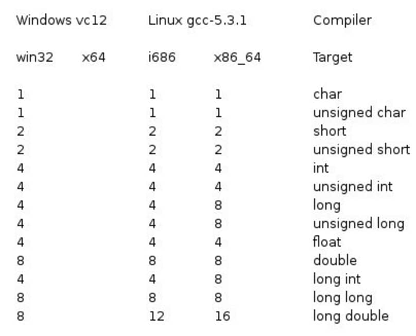

# 变量和基本类型

## 一、基本内置类型

### 1.1 算术类型

| 类型   | 关键字      |
| ---- | -------- |
| 布尔型  | bool     |
| 字符型  | char     |
| 整型   | int      |
| 浮点型  | float    |
| 双浮点型 | double   |
| 无类型  | void     |
| 宽字符型 | wchar\_t |

可寻址的最小内存块称为字节(byte)

1 字节=8 位 bit

64 位的系统中，8 字节=64bit

#### 1.1.1 带符号类型和无符号类型

带符号能表示正负，无符号类型只能表示大于等于0 的值

| 类型                 | 位         | 范围                                                     |
| ------------------ | --------- | ------------------------------------------------------ |
| char               | 1 个字节     | -128 到 127 或者 0 到 255                                  |
| unsigned char      | 1 个字节     | 0 到 255                                                |
| signed char        | 1 个字节     | -128 到 127                                             |
| int                | 4 个字节     | -2147483648 到 2147483647                               |
| unsigned int       | 4 个字节     | 0 到 4294967295                                         |
| signed int         | 4 个字节     | -2147483648 到 2147483647                               |
| short int          | 2 个字节     | -32768 到 32767                                         |
| unsigned short int | 2 个字节     | 0 到 65,535                                             |
| signed short int   | 2 个字节     | -32768 到 32767                                         |
| long int           | 8 个字节     | -9,223,372,036,854,775,808 到 9,223,372,036,854,775,807 |
| signed long int    | 8 个字节     | -9,223,372,036,854,775,808 到 9,223,372,036,854,775,807 |
| unsigned long int  | 8 个字节     | 0 到 18,446,744,073,709,551,615                         |
| float              | 4 个字节     | 精度型占4个字节（32位）内存空间，+/- 3.4e +/- 38 (\~7 个数字)            |
| double             | 8 个字节     | 双精度型占8 个字节（64位）内存空间，+/- 1.7e +/- 308 (\~15 个数字)        |
| long double        | 16 个字节    | 长双精度型 16 个字节（128位）内存空间，可提供18-19位有效数字。                  |
| wchar\_t           | 2 或 4 个字节 | 1 个宽字符                                                 |

<figure><figcaption></figcaption></figure>

### 1.2 类型转换

#### 1.2.1 静态转换

```cpp
int i = 10;
float f = static_cast<float>(i);
std::cout << i << endl;
std::cout << sizeof(i) << endl;

>>>
10
4
```

### 1.3 typedef 声明

您可以使用typedef 为一个已有的类型取一个新的名字。

```cpp
typedef type newname;

typedef int feet; // 告诉编译器 feet 是 int 的另一个名称
```

### 1.4 枚举类型

