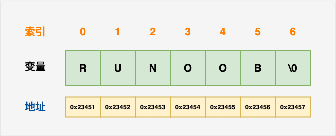

# stack 容器

## 1. 基本概念

**概念：**stack是一种**先进后出**(First In Last Out,FILO)的数据结构，它只有一个出口

<figure><figcaption></figcaption></figure>

栈中只有顶端的元素才可以被外界使用，因此栈不允许有遍历行为

栈中进入数据称为 --- **入栈** `push`

栈中弹出数据称为 --- **出栈** `pop`

## 2. 常用接口

功能描述：栈容器常用的对外接口

构造函数：

* `stack<T> stk;` //stack采用模板类实现， stack对象的默认构造形式
* `stack(const stack &stk);` //拷贝构造函数

赋值操作：

* `stack& operator=(const stack &stk);` //重载等号操作符

数据存取：

* `push(elem);` //向栈顶添加元素
* `pop();` //从栈顶移除第一个元素
* `top();` //返回栈顶元素

大小操作：

* `empty();` //判断堆栈是否为空
* `size();` //返回栈的大小

```cpp
#include<stack>
#include<iostream>

using namespace std;
//栈容器常用接口
void test01()
{
	//创建栈容器 栈容器必须符合先进后出
	stack<int> s;

	//向栈中添加元素，叫做 压栈 入栈
	s.push(10);
	s.push(20);
	s.push(30);

	while (!s.empty()) {
		//输出栈顶元素
		cout << "栈顶元素为： " << s.top() << endl;
		//弹出栈顶元素
		s.pop();
	}
	cout << "栈的大小为：" << s.size() << endl;

}
int main(){
    test01();
}
```
